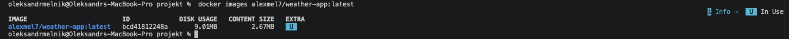
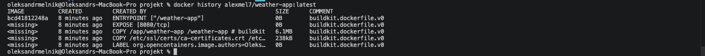
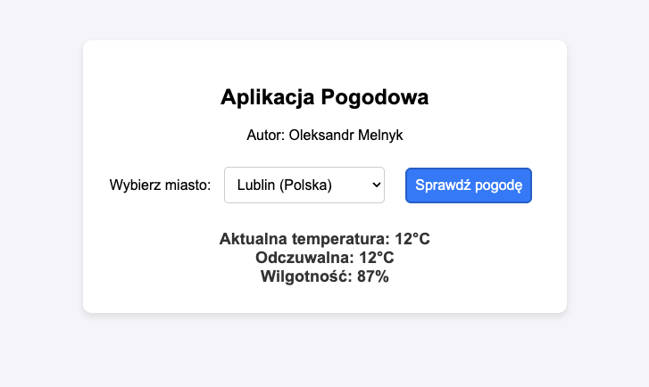

# Zadanie 1 - Część Obowiązkowa

## Autor
Oleksandr Melnyk

## Kod oprogramowania (Aplikacja Pogodowa)

Aplikacja została napisana w języku Go.  
Serwuje interfejs webowy oraz pobiera dane pogodowe z zewnętrznego API wttr.in.  
Po uruchomieniu aplikacja zapisuje w logach:
- datę uruchomienia,
- nazwę autora,
- numer portu HTTP.


1.Plik main.go
```go
package main

import (
	"encoding/json"
	"fmt"
	"log"
	"net/http"
	"os"
	"time"
)

const (
	AuthorName = "Oleksandr Melnyk"
	DefaultPort = "8080"
)

type WeatherResponse struct {
	CurrentCondition []struct {
		TempC    string `json:"temp_C"`
		FeelsLikeC string `json:"FeelsLikeC"`
		Humidity string `json:"humidity"`
	} `json:"current_condition"`
}

func main() {
	port := os.Getenv("PORT")
	if port == "" {
		port = DefaultPort
	}

	startupTime := time.Now().Format("2006-01-02 15:04:05")
	log.Printf("[START] Data uruchomienia: %s", startupTime)
	log.Printf("[START] Autor programu: %s", AuthorName)
	log.Printf("[START] Port TCP: %s", port)


	http.HandleFunc("/", handleIndex)

	http.HandleFunc("/api/weather", handleWeather)

	log.Printf("Serwer uruchomiony na porcie %s...", port)
	if err := http.ListenAndServe(":" + port, nil); err != nil {
		log.Fatalf("Błąd serwera: %v", err)
	}
}

func handleIndex(w http.ResponseWriter, r *http.Request) {
	w.Header().Set("Content-Type", "text/html; charset=utf-8")
	fmt.Fprintf(w, `
	<!DOCTYPE html>
	<html lang="pl">
	<head>
		<meta charset="UTF-8">
		<title>Aplikacja Pogodowa - PAwChO</title>
		<style>
			body { font-family: Arial, sans-serif; background: #f4f4f9; text-align: center; padding: 50px; }
			.container { background: white; padding: 30px; border-radius: 10px; box-shadow: 0 4px 8px rgba(0,0,0,0.1); display: inline-block; }
			select, button { padding: 10px; margin: 10px; font-size: 16px; border-radius: 5px; border: 1px solid #ccc; }
			button { background: #007bff; color: white; cursor: pointer; border: none; }
			button:hover { background: #0056b3; }
			#result { margin-top: 20px; font-weight: bold; font-size: 18px; color: #333; }
		</style>
	</head>
	<body>
		<div class="container">
			<h2>Aplikacja Pogodowa</h2>
			<p>Autor: %s</p>
			
			<label for="city">Wybierz miasto:</label>
			<select id="city">
				<option value="Lublin,Poland">Lublin (Polska)</option>
				<option value="Warsaw,Poland">Warszawa (Polska)</option>
				<option value="Kyiv,Ukraine">Kijów (Ukraina)</option>
				<option value="Berlin,Germany">Berlin (Niemcy)</option>
				<option value="Paris,France">Paryż (Francja)</option>
			</select>
			
			<button onclick="getWeather()">Sprawdź pogodę</button>
			<div id="result"></div>
		</div>

		<script>
			async function getWeather() {
				const location = document.getElementById('city').value;
				const resultDiv = document.getElementById('result');
				resultDiv.innerHTML = "Pobieranie danych...";
				
				try {
					const response = await fetch('/api/weather?location=' + encodeURIComponent(location));
					if (!response.ok) throw new Error('Błąd pobierania');
					const data = await response.json();
					
					resultDiv.innerHTML = "Aktualna temperatura: " + data.temp + "°C<br>" +
										  "Odczuwalna: " + data.feels + "°C<br>" +
										  "Wilgotność: " + data.humidity + "%%";
				} catch (error) {
					resultDiv.innerHTML = "Nie udało się pobrać pogody.";
				}
			}
		</script>
	</body>
	</html>
	`, AuthorName)
}

func handleWeather(w http.ResponseWriter, r *http.Request) {
	location := r.URL.Query().Get("location")
	if location == "" {
		http.Error(w, "Brak parametru location", http.StatusBadRequest)
		return
	}


	url := fmt.Sprintf("https://wttr.in/%s?format=j1", location)
	resp, err := http.Get(url)
	if err != nil {
		http.Error(w, "Błąd zewnętrznego API", http.StatusInternalServerError)
		return
	}
	defer resp.Body.Close()

	var weather WeatherResponse
	if err := json.NewDecoder(resp.Body).Decode(&weather); err != nil || len(weather.CurrentCondition) == 0 {
		http.Error(w, "Błąd parsowania danych", http.StatusInternalServerError)
		return
	}


	cond := weather.CurrentCondition[0]
	result := map[string]string{
		"temp":     cond.TempC,
		"feels":    cond.FeelsLikeC,
		"humidity": cond.Humidity,
	}

	w.Header().Set("Content-Type", "application/json")
	json.NewEncoder(w).Encode(result)
}
```
# 2. Plik Dockerfile

```dockerfile
# Etap 1: Builder
FROM golang:alpine AS builder

RUN apk --no-cache add ca-certificates

WORKDIR /app

COPY main.go .

# Kompilacja statyczna, bez informacji debugowania (optymalizacja wielkości)
RUN CGO_ENABLED=0 GOOS=linux go build -ldflags="-s -w" -o weather-app main.go

# Etap 2: Pusty obraz wynikowy
FROM scratch

LABEL org.opencontainers.image.authors="Oleksandr Melnyk" \
      org.opencontainers.image.title="Weather-App" \
      org.opencontainers.image.description="Minimalistyczna aplikacja pogodowa na laboratoria PAwChO"

COPY --from=builder /etc/ssl/certs/ca-certificates.crt /etc/ssl/certs/
COPY --from=builder /app/weather-app /weather-app

EXPOSE 8080

ENTRYPOINT ["/weather-app"]
```

## 3. Polecenia niezbędne do uruchomienia i weryfikacji

### Zbudowanie obrazu

```bash
docker build -t alexmel7/weather-app:latest .
```

### Uruchomienie kontenera

```bash
docker run -d -p 8080:8080 --name weather alexmel7/weather-app:latest
```
### Sposób uzyskania logów

```bash
docker logs weather
```
### Rozmiar i warstwy obrazu
```bash
docker images alexmel7/weather-app:latest
```


```bash
docker history alexmel7/weather-app:latest
```

## 4. Potwierdzenie działania aplikacji
