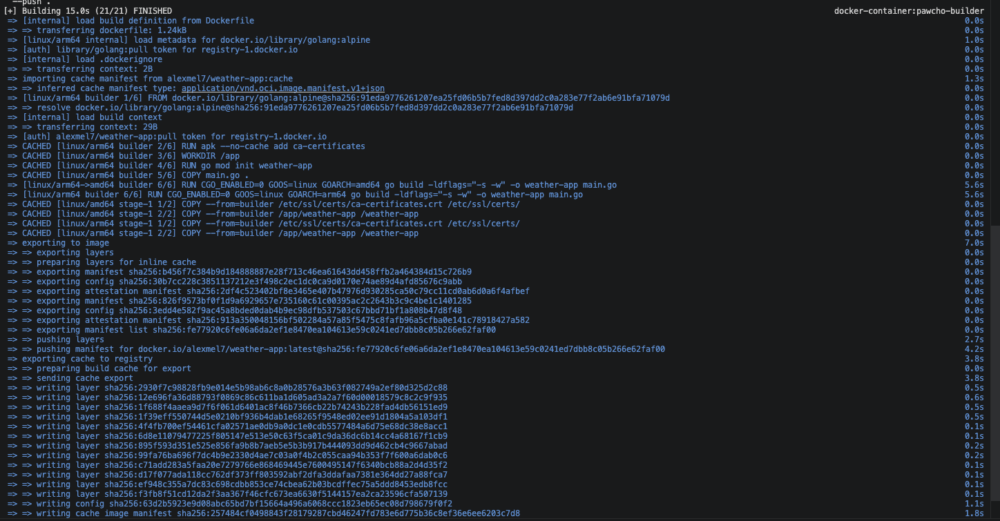
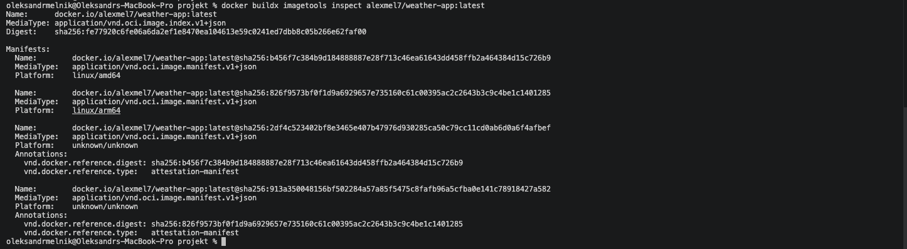
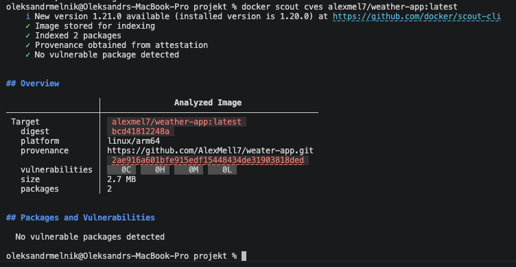

## Wieloetapowe budowanie Multi-Arch (Część Nieobowiązkowa- Wariant 50%)

```dockerfile
FROM --platform=$BUILDPLATFORM golang:alpine AS builder
RUN apk --no-cache add ca-certificates
WORKDIR /app
# Inicjalizacja modułu Go wewnątrz buildera
RUN go mod init weather-app
COPY main.go .
# Targety architektur przekazywane automatycznie przez Buildx
ARG TARGETOS
ARG TARGETARCH
# Kompilacja pod docelową architekturę z flagami optymalizacyjnymi
RUN CGO_ENABLED=0 GOOS=$TARGETOS GOARCH=$TARGETARCH \
    go build -ldflags="-s -w" -o weather-app main.go
FROM scratch
LABEL org.opencontainers.image.authors="Oleksandr Melnyk" \
      org.opencontainers.image.title="Weather-App"
COPY --from=builder /etc/ssl/certs/ca-certificates.crt /etc/ssl/certs/
COPY --from=builder /app/weather-app /weather-app
EXPOSE 8080
ENTRYPOINT ["/weather-app"] 
```

#### Zbudowanie obrazu

Poniższe polecenie wykorzystuje zaawansowane możliwości silnika BuildKit do jednoczesnego zbudowania wieloplatformowego obrazu oraz skonfigurowania zewnętrznej i wewnętrznej pamięci podręcznej (cache).

```bash
docker buildx build \
  --platform linux/amd64,linux/arm64 \
  -t alexmel7/weather-app:latest \
  --cache-to type=registry,ref=alexmel7/weather-app:cache \
  --cache-to type=inline \
  --cache-from type=registry,ref=alexmel7/weather-app:cache \
  --push .
```



#### Weryfikacja manifestu:

Wykorzystano polecenie docker buildx imagetools inspect alexmel7/weather-app:latest, które poprawnie wykazało istnienie dwóch manifestów sprzętowych: linux/amd64 oraz linux/arm64. Ponowne wywołanie polecenia budowania skutkowało użyciem pobranych danych cache (komunikaty CACHED w logach).


#### Analiza podatności na zagrożenia (CVE)

Zgodnie z wymaganiami, obraz poddano analizie pod kątem podatności przy użyciu narzędzia 
```bash
docker scout cves alexmel7/weather-app:latest
```
